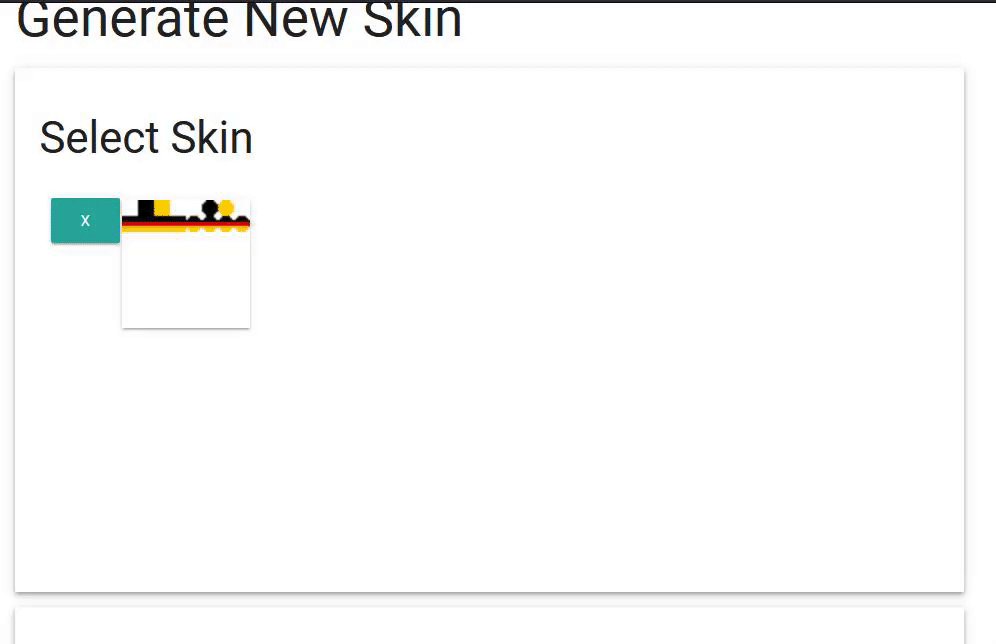

# Gui

In the gui.yml file you can add a base64 for every language that will appear in the gui.

## First of all, what is a base64?

In small words a base64 is a string containing the texture of an head.

## How can I create a base64?

With this [simple tool](https://mineskin.org) you can generate a base64 from the head of a skin.

You have to pick the `Texture Signature` value.

Here you are an easy gif that explain it.



You can also use an existing head from [Minecraft-Heads](https://minecraft-heads.com/), you have to pick the `value` value.

## How can I add a base64 to a new language?

Just add it to the gui.yml

```yaml
base:
  # Existing bases..
  "your-awesome-lang": "your awesome base64"
```


Make sure that you have already created the language in the [`languages`](configuration.md#languages) section.


